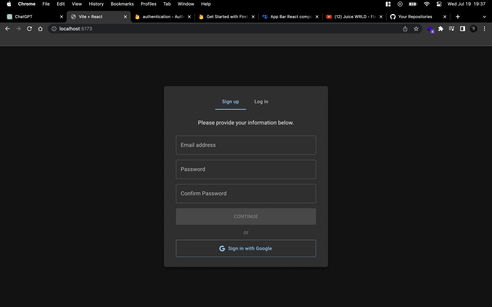
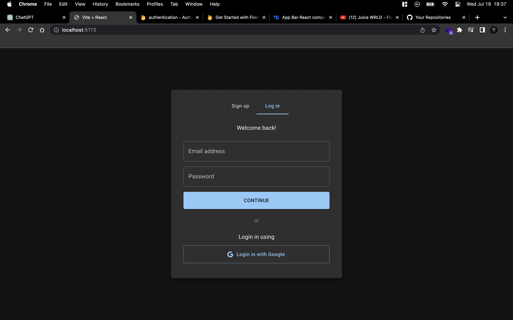
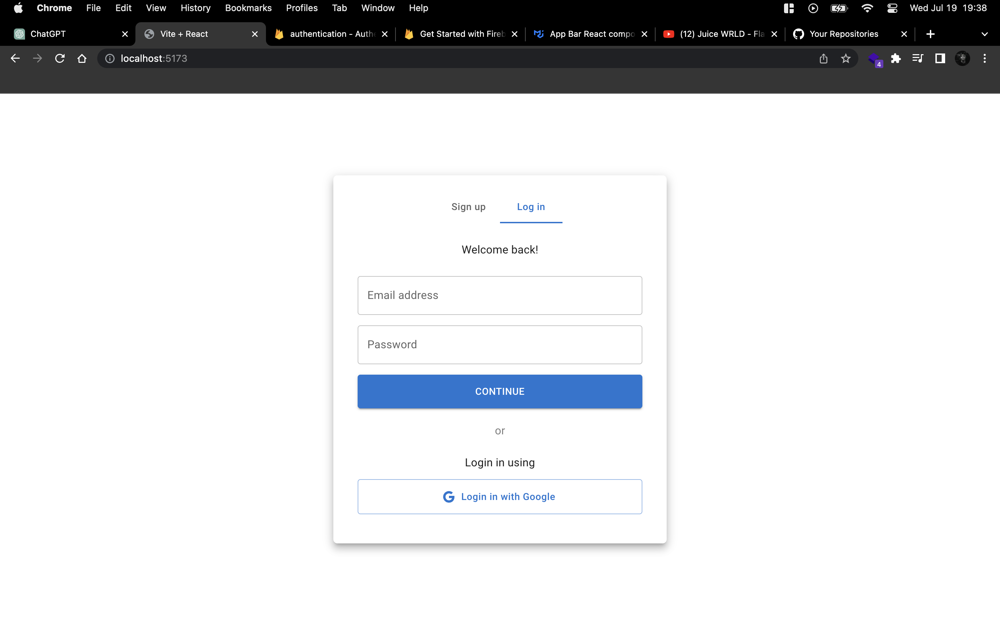

## Showcase

https://github.com/999Ali999/login-signup-mui-firebase/assets/127804196/f6bf47a6-3be1-4090-8a86-d6e40edefc11

### i have created this beautiful login / signup components in React.js (Javascript) using mui (UI library) make sure you give this repo a star it will be much appreciated.

#### Front-end:

##### React.js

##### MUI

#### Back-end:

##### Firebase

#### Features:

##### Firebase Authentication

##### Sign up with Email & Password

##### Sign up using Google (Firebase Authentication)

##### Login using the entered Email and Password

##### Login using your Google account

#### Functionalities

##### Will use your system preferences to determine its theme (dark mode / light mode)

##### Password confirmer that checks the similarity of entered passwords to prevent any misspelling while creating your account

#### How to get it to work?

##### first run "npm i"

##### second go to firebaseConfig.js file and add your firebase configuration

##### then inside go to the firebase create an app and inside the build section add Authentication to your app

##### the inside the Authentication section for the Native providers add the Email/Password and enable it

##### and for the Additional providers add Google and the add a support email for your project and then click save

##### finally run "npm run dev" and enjoy
